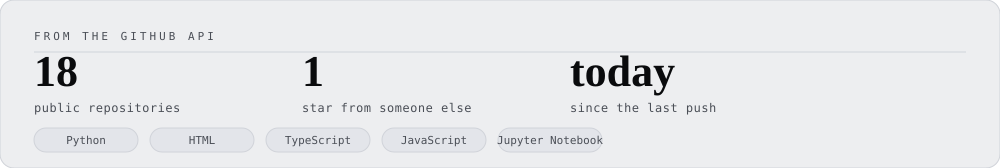

<picture>
  <source media="(prefers-color-scheme: dark)" srcset="assets/banner-dark.svg">
  <source media="(prefers-color-scheme: light)" srcset="assets/banner-light.svg">
  
</picture>

Lead Data Scientist building production GenAI systems in Uber's AI org (via Indium Software), plus independent AI products and research shipped under my own name.

**[Portfolio →](https://gaurav-gandhi.vercel.app)** where every number links to the commit it came from.

<picture>
  <source media="(prefers-color-scheme: dark)" srcset="assets/h-research-dark.svg">
  <source media="(prefers-color-scheme: light)" srcset="assets/h-research-light.svg">
  
</picture>

| Paper | What it establishes | Status | Read |
|:------|:--------------------|:-------|:-----|
| **Tool-Description Quality Is Not One Axis** | Where tool-description precision helps agent tool-use and where it backfires, as a regime analysis rather than a single quality axis. Tested on two production MCP-server mirrors (GitHub, AWS IAM) and a pre-registered pilot of 10 public Python MCP servers. | Under submission | [Paper](https://github.com/gaurav-gandhi-2411/agentgauge/blob/main/docs/paper/latex/main.pdf) · [Code](https://github.com/gaurav-gandhi-2411/agentgauge) |
| **Powering Agent Evaluations** | Variance structure, a 10-class measurement-artifact taxonomy, and a paired/CUPED estimator for agent tool-use benchmarks. Reaches a minimum detectable effect of 0.054 at n=253, against 0.433 uncorrected. | Under submission | [Paper](https://github.com/gaurav-gandhi-2411/agentgauge/blob/main/docs/paper2/main.pdf) · [Code](https://github.com/gaurav-gandhi-2411/agentgauge) |

<picture>
  <source media="(prefers-color-scheme: dark)" srcset="assets/h-focus-dark.svg">
  <source media="(prefers-color-scheme: light)" srcset="assets/h-focus-light.svg">
  
</picture>

| Area | Working with |
|:-----|:--------------|
| **LLM fine-tuning & serving** | `LoRA / QLoRA` `Ray Train` `DeepSpeed ZeRO-3` `vLLM` |
| **Multi-agent systems** | `LangGraph` `MCP` `Multi-provider routing` |
| **Retrieval & RAG** | `Hybrid search (dense + BM25)` `FAISS` `pgvector` `Reranking` |
| **Vision & multimodal** | `CLIP` `SBERT` `SDXL LoRA` `ControlNet` `ViT` |
| **Evaluation & causal measurement** | `LLM-as-judge` `Conformal prediction` `Bootstrap / CUPED` |
| **Production serving** | `FastAPI` `Cloud Run` `GCP` `Vercel` |

<picture>
  <source media="(prefers-color-scheme: dark)" srcset="assets/h-work-dark.svg">
  <source media="(prefers-color-scheme: light)" srcset="assets/h-work-light.svg">
  
</picture>

| Project | What it does | Result | Links |
|:--------|:--------------|:-------|:------|
| **TriageIQ** | Four-stage GitHub issue triage: classifies component, retrieves similar solved issues, estimates resolution time, drafts a grounded summary | 87.1% / 89.8% top-3 component accuracy (k8s / vscode) | [Live](https://triage-iq-orcin.vercel.app/) · [Repo](https://github.com/gaurav-gandhi-2411/triage-iq) |
| **AgentGauge** | Causal A/B harness measuring whether an MCP tool-description change actually moves agent task success | One blocking description defect cut task success 13.3–28.9pp across 3 model families | `pip install agentgauge-harness` · [Repo](https://github.com/gaurav-gandhi-2411/agentgauge) |
| **adk-tracegauge** | Cost-per-invocation evaluation for agents built on Google's Agent Development Kit, packaged so other people can install it against their own runs | 8 releases on PyPI, current v0.4.1 | `pip install adk-tracegauge` · [Repo](https://github.com/gaurav-gandhi-2411/adk-tracegauge) |
| **Multimodal Fashion Recommender** | Two-tower recommender aligning CLIP image embeddings with SBERT text embeddings | 3.06× Recall@10 lift over a popularity baseline | [HF Space](https://huggingface.co/spaces/gauravgandhi2411/multimodal-fashion-recommender) · [Repo](https://github.com/gaurav-gandhi-2411/multimodal-fashion-recommender) |
| **Style Maitri** | AI stylist for Indian occasion wear, searching 52,494 items across 8 stores with guardrails against invented prices and sizes | 93.8% intent-parsing accuracy (n=211) | [Live](https://gaurav-gandhi.vercel.app/warmup/style-maitri) · [Repo](https://github.com/gaurav-gandhi-2411/agentic-shopping-assistant) |
| **AetherArt** | SDXL fine-tuned into a Japanese ukiyo-e style, composed with Hyper-SD and ControlNet | 6.2GB peak VRAM, so the whole pipeline fits an 8GB consumer GPU | [Live](https://gaurav-gandhi.vercel.app/warmup/aetherart) · [Repo](https://github.com/gaurav-gandhi-2411/AetherArt) |
| **Warmer** | A word game you play once a day, where your only clue is how close each guess comes in meaning to the secret word | Hinglish relatedness eval: −0.003 → 0.813 | [Live](https://playwarmer.vercel.app/) |
| **DealHunter** | Multi-agent flight search that turns a plain-English trip request into two honestly explained trade-offs | 31/31 correct archetype selection on the planner baseline (Wilson 95% CI 89–100%) | [Live](https://gaurav-gandhi.vercel.app/warmup/dealhunter) · [Repo](https://github.com/gaurav-gandhi-2411/agentic-travel-booking-system) |
| **Samidha Reviews** | Turns customer reviews into structured insight across English, Hindi, and Hinglish with tiered LLM routing | 83.8% extraction accuracy (en/hi/hi-en) | [Live](https://app.samidhareviews.xyz) · [Repo](https://github.com/gaurav-gandhi-2411/review-iq) |

<picture>
  <source media="(prefers-color-scheme: dark)" srcset="assets/h-how-dark.svg">
  <source media="(prefers-color-scheme: light)" srcset="assets/h-how-light.svg">
  
</picture>

Every project ships with a pre-registered evaluation harness, and negative results get published rather than buried. Three that cost something to publish:

| Project | What it falsified | Case study |
|:--------|:------------------|:-----------|
| **AgentGauge** | Its own v1 thesis. The 8-axis LLM-judged quality score did not predict real task success once corrected for multiple comparisons and prompt length, so the project was rebuilt around a causal A/B harness instead of patched to save the score. | [Read](https://gaurav-gandhi.vercel.app/work/agentgauge) |
| **Gold Rate Tracker** | Its own model. Across a 204-fold backtest the naive forecast still beats the ML model, MAE 251.99 against 293.10, so the naive baseline is what runs in production. | [Read](https://gaurav-gandhi.vercel.app/work/gold-rate-tracker) |
| **AetherArt** | A published conclusion, including its own. CLIP score, the field's default image-quality metric, turned out to be structurally blind to real quality changes in most cases tested. Re-running under a stricter statistical bar cut the project's headline finding from 9/9 to 4/9, and the smaller number is what it reports. | [Read](https://gaurav-gandhi.vercel.app/work/aetherart) |

<picture>
  <source media="(prefers-color-scheme: dark)" srcset="assets/h-corrections-dark.svg">
  <source media="(prefers-color-scheme: light)" srcset="assets/h-corrections-light.svg">
  
</picture>

I keep a written record of measurements that turned out to be lying, and of whatever caught each one. Twenty-eight write-ups so far. Some are checks I broke on purpose to see whether they would notice.

| What the check reported | What was actually true |
|:------------------------|:-----------------------|
| A header test confirmed the nav band shrinks on scroll. | It did, and the shrinking was the bug. The band sat in flow, so every element below it moved too. The test had been written after reading the code, so it could only ever agree with it. |
| A quality gate printed that all thresholds pass, retrieval at 100%. | One test case had been deleted, the single case the retriever got wrong. The score went from 95.0% to 100% by removing the question. |

Both are fixed, and both fixes were checked against a build with the fix reverted.

<picture>
  <source media="(prefers-color-scheme: dark)" srcset="assets/h-journey-dark.svg">
  <source media="(prefers-color-scheme: light)" srcset="assets/h-journey-light.svg">
  
</picture>

| Years | What I was doing | Where |
|:------|:-----------------|:------|
| 2021–2022 | Data engineering: GCP ETL pipelines and dashboards | TCS |
| 2022–2024 | Decision science: Bayesian change-point detection, SARIMA forecasting | FedEx |
| 2024–2025 | Applied GenAI in production: 144-GPU document-understanding transformer, session-aware recommender | Uber AI, via Indium |
| 2025–now | Leading a 5-person GenAI team, shipping AI products and research under my own name | Independent |

[Résumé](https://gaurav-gandhi.vercel.app/resume.pdf) · [Portfolio](https://gaurav-gandhi.vercel.app)

<picture>
  <source media="(prefers-color-scheme: dark)" srcset="assets/h-stack-dark.svg">
  <source media="(prefers-color-scheme: light)" srcset="assets/h-stack-light.svg">
  
</picture>

| Layer | Tools |
|:------|:------|
| **LLM & fine-tuning** | PyTorch · LoRA / QLoRA · Ray Train · DeepSpeed ZeRO-3 · Transformers |
| **Agents** | LangGraph · MCP · Multi-provider routing (Groq, Anthropic, OpenRouter) |
| **Retrieval & RAG** | FAISS · pgvector · BM25 hybrid search · Reranking |
| **Vision & multimodal** | CLIP · SBERT · SDXL LoRA · ControlNet · ViT |
| **Evaluation** | LLM-as-judge · Conformal prediction · Bootstrap / CUPED · Causal A/B |
| **Serving** | FastAPI · Cloud Run · Docker · Vercel · GCP |
| **Data & ops** | Dagster · GitHub Actions · Prometheus · structlog |

<picture>
  <source media="(prefers-color-scheme: dark)" srcset="assets/stats-dark.svg">
  <source media="(prefers-color-scheme: light)" srcset="assets/stats-light.svg">
  
</picture>

Generated from the GitHub API by [a scheduled Action](.github/workflows/stats.yml) and committed as SVG, so this page never loads an image from anyone else's server and the numbers only move in a commit you can read.

<picture>
  <source media="(prefers-color-scheme: dark)" srcset="assets/divider-dark.svg">
  <source media="(prefers-color-scheme: light)" srcset="assets/divider-light.svg">
  
</picture>

<picture>
  <source media="(prefers-color-scheme: dark)" srcset="assets/monogram-dark.svg">
  <source media="(prefers-color-scheme: light)" srcset="assets/monogram-light.svg">
  
</picture>

[Portfolio](https://gaurav-gandhi.vercel.app) · [Résumé](https://gaurav-gandhi.vercel.app/resume.pdf) · [LinkedIn](https://www.linkedin.com/in/gauravgandhi03/) · [Email](mailto:gauravgandhi429@gmail.com)
