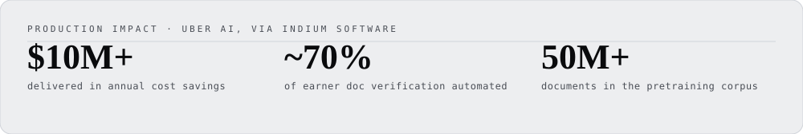
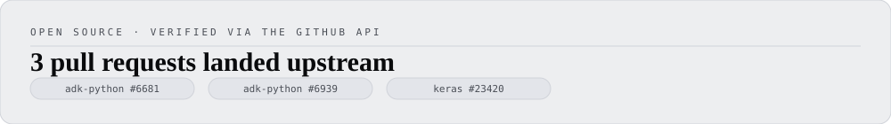

<picture>
  <source media="(prefers-color-scheme: dark)" srcset="assets/banner-dark.svg">
  <source media="(prefers-color-scheme: light)" srcset="assets/banner-light.svg">
  
</picture>

Lead Data Scientist building production GenAI systems in Uber's AI org (via Indium Software), plus independent AI products and research shipped under my own name.

**[Portfolio →](https://gaurav-gandhi.vercel.app)** where every number links to the commit it came from.

<a href="https://github.com/gaurav-gandhi-2411/gg-portfolio/blob/main/content/experience.ts">
  <picture>
    <source media="(prefers-color-scheme: dark)" srcset="assets/c-impact-dark.svg">
    <source media="(prefers-color-scheme: light)" srcset="assets/c-impact-light.svg">
    
  </picture>
</a>

<picture>
  <source media="(prefers-color-scheme: dark)" srcset="assets/h-work-dark.svg">
  <source media="(prefers-color-scheme: light)" srcset="assets/h-work-light.svg">
  
</picture>

| Project | What it does | Result | Links |
|:--------|:--------------|:-------|:------|
| **TriageIQ** | Four-stage GitHub issue triage: classifies component, retrieves similar solved issues, estimates resolution time, drafts a grounded summary | 87.1% / 89.8% top-3 component accuracy (k8s / vscode) | [Live](https://triage-iq-orcin.vercel.app/) · [Repo](https://github.com/gaurav-gandhi-2411/triage-iq) |
| **AgentGauge** | Causal A/B harness measuring whether an MCP tool-description change actually moves agent task success | One blocking description defect cut task success 13.3–28.9pp across 3 model families | `pip install agentgauge-harness` · [Repo](https://github.com/gaurav-gandhi-2411/agentgauge) |
| **adk-tracegauge** | Fails your build when an agent starts costing more per run, and tells you, every run, the smallest rise it could actually have caught | 78.2s from a fresh install to a real verdict | `pip install adk-tracegauge` · [Repo](https://github.com/gaurav-gandhi-2411/adk-tracegauge) |
| **tracegauge** | Scores a Claude Code session on how efficient it was, and shows you where the tokens went to waste | 84% strict agreement with a reference LLM judge (Spearman ρ≈0.79) | `pip install tracegauge` · [Repo](https://github.com/gaurav-gandhi-2411/token-efficiency-scorer) |
| **Multimodal Fashion Recommender** | Two-tower recommender aligning CLIP image embeddings with SBERT text embeddings | 3.06× Recall@10 lift over a popularity baseline | [HF Space](https://huggingface.co/spaces/gauravgandhi2411/multimodal-fashion-recommender) · [Repo](https://github.com/gaurav-gandhi-2411/multimodal-fashion-recommender) |
| **Style Maitri** | AI stylist for Indian occasion wear, searching 52,494 items across 8 stores with guardrails against invented prices and sizes | 93.8% intent-parsing accuracy (n=211) | [Live](https://gaurav-gandhi.vercel.app/warmup/style-maitri) · [Repo](https://github.com/gaurav-gandhi-2411/agentic-shopping-assistant) |
| **AetherArt** | SDXL fine-tuned into a Japanese ukiyo-e style, composed with Hyper-SD and ControlNet | 6.2GB peak VRAM, so the whole pipeline fits an 8GB consumer GPU | [Live](https://gaurav-gandhi.vercel.app/warmup/aetherart) · [Repo](https://github.com/gaurav-gandhi-2411/AetherArt) |
| **Warmer** | A word game you play once a day, where your only clue is how close each guess comes in meaning to the secret word | Hinglish relatedness eval: −0.003 → 0.813 | [Live](https://playwarmer.vercel.app/) |
| **DealHunter** | Multi-agent flight search that turns a plain-English trip request into two honestly explained trade-offs | 31/31 correct archetype selection on the planner baseline (Wilson 95% CI 89–100%) | [Live](https://gaurav-gandhi.vercel.app/warmup/dealhunter) · [Repo](https://github.com/gaurav-gandhi-2411/agentic-travel-booking-system) |
| **Samidha Reviews** | Turns customer reviews into structured insight across English and Hinglish with tiered LLM routing | [78.6% (95% CI 73–83%, n=43, eval 2026-09-19)](https://github.com/gaurav-gandhi-2411/review-iq/blob/main/eval/report.md) | [Live](https://app.samidhareviews.xyz) · [Repo](https://github.com/gaurav-gandhi-2411/review-iq) |

<picture>
  <source media="(prefers-color-scheme: dark)" srcset="assets/h-opensource-dark.svg">
  <source media="(prefers-color-scheme: light)" srcset="assets/h-opensource-light.svg">
  
</picture>

<a href="#open-source-detail">
  <picture>
    <source media="(prefers-color-scheme: dark)" srcset="assets/c-opensource-dark.svg">
    <source media="(prefers-color-scheme: light)" srcset="assets/c-opensource-light.svg">
    
  </picture>
</a>

Each proven by a commit on the target repo's own default branch, not just a merged-PR badge — verified live against the GitHub API, not hand-typed.

| Fix | Repo | Landed as |
|:----|:-----|:----------|
| Resolved a `NameError` in the ADK CLI's legacy create-eval-set route | [google/adk-python](https://github.com/google/adk-python) | [#6681](https://github.com/google/adk-python/pull/6681) via Copybara · [`023f45c`](https://github.com/google/adk-python/commit/023f45c3e5846c3e72525b53f16ef018b5ecdaa6) |
| Made `JudgeModelOptions` reject `num_samples=0` at construction instead of failing mid-run | [google/adk-python](https://github.com/google/adk-python) | [#6939](https://github.com/google/adk-python/pull/6939) via Copybara · [`85e0868`](https://github.com/google/adk-python/commit/85e08686f8310e00b2b031a042db86405920b4b2) |
| Fixed `R2Score` returning `NaN` instead of `1.0` for a perfect prediction on zero-variance data | [keras-team/keras](https://github.com/keras-team/keras) | [#23420](https://github.com/keras-team/keras/pull/23420) · [`f3b31e4`](https://github.com/keras-team/keras/commit/f3b31e4f4667849d98c1e230e142c9f445f2eed0) |

In review, not counted above: [google/adk-python #6739](https://github.com/google/adk-python/pull/6739) · [#6740](https://github.com/google/adk-python/pull/6740).

Own packages on PyPI: [`tracegauge`](https://pypi.org/project/tracegauge/) · [`adk-tracegauge`](https://pypi.org/project/adk-tracegauge/) · [`agentgauge-harness`](https://pypi.org/project/agentgauge-harness/)

<picture>
  <source media="(prefers-color-scheme: dark)" srcset="assets/h-how-dark.svg">
  <source media="(prefers-color-scheme: light)" srcset="assets/h-how-light.svg">
  
</picture>

Every project ships with a pre-registered evaluation harness; negative results get published, not buried:

| Project | What it falsified | Case study |
|:--------|:------------------|:-----------|
| **AgentGauge** | Its own v1 thesis. The 8-axis LLM-judged quality score did not predict real task success once corrected for multiple comparisons and prompt length, so the project was rebuilt around a causal A/B harness instead of patched to save the score. | [Read](https://gaurav-gandhi.vercel.app/work/agentgauge) |
| **Gold Rate Tracker** | Its own model. Across a 209-fold backtest the naive forecast still beats the ML model, MAE 249.24 against 292.14, so the naive baseline is what runs in production. | [Read](https://gaurav-gandhi.vercel.app/work/gold-rate-tracker) |
| **AetherArt** | A published conclusion, including its own. CLIP score, the field's default image-quality metric, turned out to be structurally blind to real quality changes in most cases tested. Re-running under a stricter statistical bar cut the project's headline finding from 9/9 to 4/9, and the smaller number is what it reports. | [Read](https://gaurav-gandhi.vercel.app/work/aetherart) |

I keep a written record of measurements that turned out to be lying, and of whatever caught each one. One example: a header test confirmed the nav band shrinks on scroll. It did, and the shrinking was the bug — the band sat in flow, so every element below it moved too. The test had been written after reading the code, so it could only ever agree with it. [Full corrections log →](docs/corrections.md)

<picture>
  <source media="(prefers-color-scheme: dark)" srcset="assets/h-research-dark.svg">
  <source media="(prefers-color-scheme: light)" srcset="assets/h-research-light.svg">
  
</picture>

| Paper | What it establishes | Status | Read |
|:------|:--------------------|:-------|:-----|
| **Tool-Description Quality Is Not One Axis** | Where tool-description precision helps agent tool-use and where it backfires, as a regime analysis rather than a single quality axis. Tested on two production MCP-server mirrors (GitHub, AWS IAM) and a pre-registered pilot of 10 public Python MCP servers. | Working paper (draft, not yet submitted) | [Paper](https://github.com/gaurav-gandhi-2411/agentgauge/blob/main/docs/paper/latex/main.pdf) · [Code](https://github.com/gaurav-gandhi-2411/agentgauge) |
| **Powering Agent Evaluations** | Variance structure, a 10-class measurement-artifact taxonomy, and a paired/CUPED estimator for agent tool-use benchmarks. Reaches a minimum detectable effect of 0.054 at n=253, against 0.433 uncorrected. | Working paper (draft, not yet submitted) | [Paper](https://github.com/gaurav-gandhi-2411/agentgauge/blob/main/docs/paper2/main.pdf) · [Code](https://github.com/gaurav-gandhi-2411/agentgauge) |

<picture>
  <source media="(prefers-color-scheme: dark)" srcset="assets/h-journey-dark.svg">
  <source media="(prefers-color-scheme: light)" srcset="assets/h-journey-light.svg">
  
</picture>

| Years | What I was doing | Where |
|:------|:-----------------|:------|
| 2021–2022 | Data engineering: GCP ETL pipelines and dashboards | TCS |
| 2022–2024 | Decision science: Bayesian change-point detection, SARIMA forecasting | FedEx |
| 2024–2025 | Data Scientist: multi-agent analytics copilot (hybrid RAG + NL2SQL), session-aware recommender | Uber AI, via Indium |
| 2025–2026 | Senior Data Scientist: 144-GPU document-understanding transformer, ViT-based document-verification automation | Uber AI, via Indium |
| 2026–now | Lead Data Scientist: leading a 5-person GenAI team across document-intelligence and conversational-AI workstreams | Uber AI, via Indium |

[Résumé](https://gaurav-gandhi.vercel.app/resume.pdf) · [Portfolio](https://gaurav-gandhi.vercel.app)

<picture>
  <source media="(prefers-color-scheme: dark)" srcset="assets/h-stack-dark.svg">
  <source media="(prefers-color-scheme: light)" srcset="assets/h-stack-light.svg">
  
</picture>

| Layer | Tools |
|:------|:------|
| **LLM & fine-tuning** | PyTorch · LoRA / QLoRA · Ray Train · DeepSpeed ZeRO-3 · Transformers · vLLM |
| **Agents** | LangGraph · MCP · Multi-provider routing (Groq, Anthropic, OpenRouter) |
| **Retrieval & RAG** | FAISS · pgvector · BM25 hybrid search · Reranking |
| **Vision & multimodal** | CLIP · SBERT · SDXL LoRA · ControlNet · ViT |
| **Evaluation** | LLM-as-judge · Conformal prediction · Bootstrap / CUPED · Causal A/B |
| **Serving** | FastAPI · Cloud Run · Docker · Vercel · GCP |
| **Data & ops** | Dagster · GitHub Actions · Prometheus · structlog |

<picture>
  <source media="(prefers-color-scheme: dark)" srcset="assets/stats-dark.svg">
  <source media="(prefers-color-scheme: light)" srcset="assets/stats-light.svg">
  
</picture>

Generated from the GitHub API by [a scheduled Action](.github/workflows/stats.yml) and committed as SVG, so this page never loads an image from anyone else's server and the numbers only move in a commit you can read.

<picture>
  <source media="(prefers-color-scheme: dark)" srcset="assets/divider-dark.svg">
  <source media="(prefers-color-scheme: light)" srcset="assets/divider-light.svg">
  
</picture>

<picture>
  <source media="(prefers-color-scheme: dark)" srcset="assets/monogram-dark.svg">
  <source media="(prefers-color-scheme: light)" srcset="assets/monogram-light.svg">
  
</picture>

[Portfolio](https://gaurav-gandhi.vercel.app) · [Résumé](https://gaurav-gandhi.vercel.app/resume.pdf) · [LinkedIn](https://www.linkedin.com/in/gauravgandhi03/) · [Email](mailto:gauravgandhi429@gmail.com)
